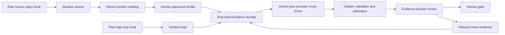

# Ops Evidence Synthesis (OES)

[](https://github.com/yukimurata0421/ops-evidence-synthesis/actions/workflows/ci.yml)


**Evidence-grounded DevOps Incident Review Agent for SREs.**

Five AIs can agree and still be wrong. OES does not turn model agreement into
an incident cause. It fixes sanitized evidence, validates citations, preserves
counter-evidence and missing evidence, and returns the final decision to a
human reviewer.

> Do not ask AI to guess the cause. Ask it to collect the evidence required to
> call something a cause.

## Hackathon Submission

- [3-minute demo video](https://www.youtube.com/watch?v=hgSiKY0z3Vs)
- [ProtoPedia article](https://protopedia.net/prototype/8892)
- [Live Cloud Run product](https://ops-evidence.yukimurata0421.dev/)
- [Submission summary](HACKATHON_SUBMISSION.md)
- [v0.1.0 release](https://github.com/yukimurata0421/ops-evidence-synthesis/releases/tag/v0.1.0)

## See the Value in 60 Seconds

1. Open the
   [approved Code Profile](https://ops-evidence.yukimurata0421.dev/code-profiles/31dd5326f0e9e052697975e7174d9de6ebf7c2fde58625cb96ce41f29faab621/)
   to see Gemini's system reading, human answers, normalized interpretation,
   approval SHA, and disabled source access after approval.
2. Open the
   [45,000-row incident review](https://ops-evidence.yukimurata0421.dev/ui/full-review-page?evidence_sha256=b7d56da85abe109ab044e05d4fc7b40462615e5b230db2b570f717c83762ab96)
   to inspect Evidence IDs, counter-evidence, missing evidence, provider
   positions, and the human promotion gate.
3. Open
   [More Data Rescore](https://ops-evidence.yukimurata0421.dev/ui/rescore-demo?id=amazon-notify-more-data-rescore)
   to see new evidence move a saved review from `needs_more_data` to
   `evidence_collected` without silently accepting a cause.

The
[Fast GCP Review](https://ops-evidence.yukimurata0421.dev/ui/fast-gcp-review)
runs Gemini 3.1 Flash-Lite from Cloud Run over a fixed 2,000-row sanitized
sample and returns a review URL. It accepts no arbitrary log, URL, or file-path
input.

## The Differentiator

Most incident AI demos start with logs and end with a confident summary. OES
adds the missing control loop:

1. **Understand the system first.** Gemini reads sanitized source artifacts and
   drafts the system purpose, service path, log semantics, and metrics.
2. **Make semantics human-owned.** An operator answers questions in natural
   language, reviews the normalized JSON patch, and explicitly approves it.
3. **Freeze the evidence boundary.** The approved profile, human answers, model
   output, and sanitized Evidence Bundle are SHA-bound.
4. **Investigate with guarded autonomy.** Providers analyze the same evidence,
   citations are checked, and disagreement becomes review work.
5. **Stop safely.** Evidence, counter-evidence, and missing evidence are shown
   before a human promotes any cause or operation.

Agreement is a review signal, not majority-vote truth. The score is review
priority, not incident probability.

## Recorded Review Cases

| Case | Public role | Evidence SHA256 | Notes |
| --- | --- | --- | --- |
| stream_v3 Dell runtime | Primary reviewer path | `b7d56da85abe109ab044e05d4fc7b40462615e5b230db2b570f717c83762ab96` | 45,000 input lines, 45,000 re-sanitized events, 1,036 Evidence Items, 5/5 providers, 0 auto-promoted causes. |
| amazon-notify | Guarded review example | `b99da97cab19f026b5475cdaa6100fdd6ebb6d96466a43e6b62a44b99ac414ec` | 44,944 sanitized rows, 8,519 Evidence Items, 5/5 providers, 0 auto-promoted causes. |
| stream_v3 arena-server monitoring | Monitoring-plane validation | `8d165418fca88f856d8525bbdae804b6b649455450796b2dc44d2134b21abd9a` | 50,000 staged input lines, 49,942 sanitized events, 2 human-gated validation targets. |
| amazon-notify deterministic fixture | Offline regeneration path | `a6af3d3ca5cc7254abbc97b232a430e1be111c8ce66adb28f32b9ee23b47cf75` | Regenerated by `make demo` from committed public-safe logs. |
| payment-api sample | Compact smoke fixture | `518a25bd716c2c37ba10db0f3a56ab6562eb65e88e7b6b0b1c65c5f34d4ab38e` | Regenerated by `make demo-sample`. |

## Architecture



The agent trace exposes an ADK-compatible tool contract for freezing evidence,
running providers, validating citations, computing review targets, requesting
more evidence, and arbitrating the human gate. The public submission does not
claim an Agent Runtime deployment.

## Measured Evidence, Not a Toy Prompt

| Public case | Sanitized corpus | Evidence Items | Provider result | Human-gated outcome |
| --- | ---: | ---: | --- | --- |
| stream_v3 runtime | 45,000 rows | 1,036 | 5/5 schema-valid outputs | 0 Primary, 6 Validation Targets |
| amazon-notify | 44,944 rows | 8,519 | 5/5 schema-valid outputs | 0 auto-promoted causes |
| stream_v3 monitoring plane | 49,942 of 50,000 staged rows | recorded full-corpus ledger | separate monitoring review | 2 Validation Targets |

The main demo target, `stream_v3`, is a 24/7 YouTube Live delivery system for
ADS-B aircraft visuals and program audio. A separate `amazon-notify` system and
a separate monitoring-plane corpus demonstrate that the review contracts are
not tied to one application or one JSON fixture.

Detailed evidence is in
[stream_v3 real API runs](docs/stream-v3-real-api-runs.md) and the
[amazon-notify five-provider run](docs/real-api-5-provider-run.md).

## Google Cloud and Agent Implementation

| Layer | Submission implementation |
| --- | --- |
| Live product | Cloud Run read-only UI/API and bounded Fast GCP Review |
| Model execution | Gemini 3.1 Flash-Lite through the Gemini Enterprise Agent Platform API; Gemma and open-model cross-checks use Vertex AI Model Garden / MaaS integrations |
| Agent contract | ADK-compatible investigation tools with a visible persisted trace |
| Build and release | Cloud Build, Artifact Registry, digest-pinned Cloud Run revisions, and live smoke tests |
| Evidence handoff | Private GCS artifacts for sanitized evidence and precomputed reviews |
| Production template | Terraform for Cloud Run Job, Cloud SQL for PostgreSQL, BigQuery, Secret Manager, and monitoring |

The initial public review pages are precomputed so a judge sees evidence
immediately without spending model tokens. The Fast GCP Review is the bounded
live API proof. Recorded full-corpus provider runs preserve model hashes,
schema status, evidence coverage, and review outputs for auditability.

## Reproduce the Public Review Locally

This path needs no cloud credentials, private logs, or network model call.

```bash
git clone https://github.com/yukimurata0421/ops-evidence-synthesis.git
cd ops-evidence-synthesis
python3 -m venv .venv
. .venv/bin/activate
python -m pip install -e ".[test,api]"
make demo
make verify-precomputed
python -m uvicorn ops_evidence_synthesis.api:app --host 127.0.0.1 --port 8080
```

Open:

```text
http://127.0.0.1:8080/?evidence_sha256=a6af3d3ca5cc7254abbc97b232a430e1be111c8ce66adb28f32b9ee23b47cf75
```

Run the complete local gate and public smoke checks:

```bash
make ci
make smoke-public
make smoke-demo-video
```

## Safety Boundary

- Raw logs, raw source trees, SQLite databases, and credentials stay local.
- Models receive sanitized Evidence Items plus approved profile context.
- Approval freezes human answers and model provenance into a SHA-bound
  `approved_operational_profile.v1`.
- Downstream log analysis rejects attempts to reintroduce source context after
  approval.
- Sanitized bundle/profile/source-context artifacts can be staged in a private
  GCS bucket for Cloud Run Job execution; raw logs and source trees are excluded.
- PostgreSQL chunk reuse is keyed by a provider/model/prompt/output-contract
  execution SHA, preventing reuse across model generations.
- PostgreSQL keeps current chunk state in `provider_chunk_runs` and append-only
  attempt history in `provider_chunk_attempts`.
- API and UI reads prefer the persisted Canonical Review Graph when available.
- Public endpoints are read-only except for bounded fixed-sample demos with
  rate limits and billing guards.
- Provider agreement cannot bypass user-impact, evidence, or human gates.
- Final causal judgement and operational action remain human-owned.

See [Data boundary](docs/data-boundary.md) and the
[Evidence Bundle contract](docs/evidence_bundle.md) for the exact artifact
boundary.

## Repository Guide

- [Architecture](docs/architecture.md) — complete local-first and cloud flow
- [Review modes](docs/review-modes-runbook.md) — replay, live, and forensic modes
- [Current implementation and roadmap](docs/current-vs-architecture-gap.md) — implemented state versus production gaps
- [Public documentation inventory](docs/public-documentation-inventory.md) — canonical reviewer-facing documents
- [Precomputed review renderer](src/ops_evidence_synthesis/web/precomputed_review.py) — public review UI and graph projections
- [Review arbitration](src/ops_evidence_synthesis/synthesis/review_arbitration.py) — evidence-aware target routing
- [ADK investigator](src/ops_evidence_synthesis/agents/adk_investigator.py) — guarded tool contract and trace
- [Tests](tests/) — fixture regeneration, safety gates, UI contracts, and API behavior

Operator-oriented CLI, private GCS review, deployment, and infrastructure
instructions live in `docs/`, `scripts/README.md`, and
`infra/terraform/README.md` so this page stays focused on evaluation.

## License

All rights reserved. This repository is published for hackathon review and
demonstration purposes. See [LICENSE](LICENSE).

## Author

Yuki Murata
